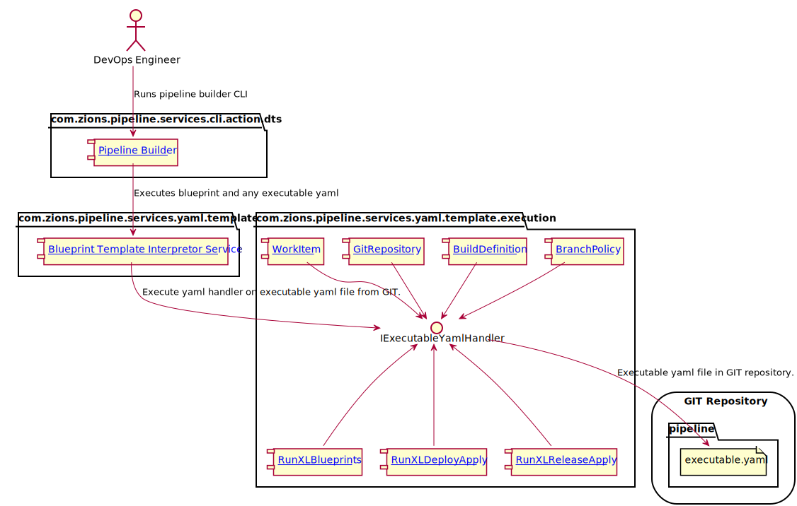

# Introduction
This document outlines command line actions provided for ADO/XLD/XLR CI/CD automation.  It lays out design details of each component involved 
in running and processing XL blueprints via a Command Line Interface (CLI).

# Pipeline Builder Components



<div hidden>
```{r, include=FALSE}
@startuml PipelineBuilder_components.svg
actor RE as "DevOps Engineer"
package "com.zions.pipeline.services.cli.action.dts" {
   component PB as "[[https://dev.azure.com/zionseto/DTS/_git/zions-service-framework?path=%2Fzions-pipeline-cli%2Fsrc%2Fmain%2Fgroovy%2Fcom%2Fzions%2Fpipeline%2Fservices%2Fcli%2Faction%2Fdts%2FPipelineBuilder.groovy&version=GBmaster&line=1&lineEnd=2&lineStartColumn=1&lineEndColumn=1&lineStyle=plain Pipeline Builder]]"
} 
RE --> PB : "Runs pipeline builder CLI"
package "com.zions.pipeline.services.yaml.template" {
  component BTIS as "[[https://dev.azure.com/zionseto/DTS/_git/zions-service-framework?path=%2Fzions-pipeline-services%2Fsrc%2Fmain%2Fgroovy%2Fcom%2Fzions%2Fpipeline%2Fservices%2Fyaml%2Ftemplate%2FBlueprintTemplateInterpretorService.groovy Blueprint Template Interpretor Service]]"
}
PB --> BTIS: Executes blueprint and any executable yaml
package "com.zions.pipeline.services.yaml.template.execution" {
  interface IExecutableYamlHandler
  component BP as "[[https://dev.azure.com/zionseto/DTS/_git/zions-service-framework?path=%2Fzions-pipeline-services%2Fsrc%2Fmain%2Fgroovy%2Fcom%2Fzions%2Fpipeline%2Fservices%2Fyaml%2Ftemplate%2Fexecution%2FBranchPolicy.groovy BranchPolicy]]"
  component BD as "[[https://dev.azure.com/zionseto/DTS/_git/zions-service-framework?path=%2Fzions-pipeline-services%2Fsrc%2Fmain%2Fgroovy%2Fcom%2Fzions%2Fpipeline%2Fservices%2Fyaml%2Ftemplate%2Fexecution%2FBuildDefinition.groovy BuildDefinition]]"
  component GR as "[[https://dev.azure.com/zionseto/DTS/_git/zions-service-framework?path=%2Fzions-pipeline-services%2Fsrc%2Fmain%2Fgroovy%2Fcom%2Fzions%2Fpipeline%2Fservices%2Fyaml%2Ftemplate%2Fexecution%2FGitRepository.groovy GitRepository]]"
  component RXLB as "[[https://dev.azure.com/zionseto/DTS/_git/zions-service-framework?path=%2Fzions-pipeline-services%2Fsrc%2Fmain%2Fgroovy%2Fcom%2Fzions%2Fpipeline%2Fservices%2Fyaml%2Ftemplate%2Fexecution%2FRunXLBlueprints.groovy RunXLBlueprints]]"
  component RXLDA as "[[https://dev.azure.com/zionseto/DTS/_git/zions-service-framework?path=%2Fzions-pipeline-services%2Fsrc%2Fmain%2Fgroovy%2Fcom%2Fzions%2Fpipeline%2Fservices%2Fyaml%2Ftemplate%2Fexecution%2FRunXLDeployApply.groovy RunXLDeployApply]]"
  component RXLRA as "[[https://dev.azure.com/zionseto/DTS/_git/zions-service-framework?path=%2Fzions-pipeline-services%2Fsrc%2Fmain%2Fgroovy%2Fcom%2Fzions%2Fpipeline%2Fservices%2Fyaml%2Ftemplate%2Fexecution%2FRunXLReleaseApply.groovy RunXLReleaseApply]]"
  component WI as "[[https://dev.azure.com/zionseto/DTS/_git/zions-service-framework?path=%2Fzions-pipeline-services%2Fsrc%2Fmain%2Fgroovy%2Fcom%2Fzions%2Fpipeline%2Fservices%2Fyaml%2Ftemplate%2Fexecution%2FWorkItem.groovy WorkItem]]"
  BP -do-> IExecutableYamlHandler
  BD --> IExecutableYamlHandler
  GR --> IExecutableYamlHandler
  RXLB -up-> IExecutableYamlHandler
  RXLDA -up-> IExecutableYamlHandler
  RXLRA -up-> IExecutableYamlHandler
  WI -do-> IExecutableYamlHandler
}
BTIS --> IExecutableYamlHandler : Execute yaml handler on executable yaml file from GIT.
storage "GIT Repository" {
  folder "pipeline" {
	  file ey as "executable.yaml"
  }
}
IExecutableYamlHandler -do-> ey : Executable yaml file in GIT repository.
@enduml
```
</div>

### Component: [Pipeline Builder](https://dev.azure.com/zionseto/DTS/_git/zions-service-framework?path=%2Fzions-pipeline-cli%2Fsrc%2Fmain%2Fgroovy%2Fcom%2Fzions%2Fpipeline%2Fservices%2Fcli%2Faction%2Fdts%2FPipelineBuilder.groovy&version=GBmaster&line=1&lineEnd=2&lineStartColumn=1&lineEndColumn=1&lineStyle=plain) - CLI Arguments:

When a **DevOps Engineer** executes the **Pipeline Builder CLI** the following arguments must be set on CLI:

- **repo.dir** - location of GIT repository housing executable yaml.
- **blueprint.dir** - local file system location of loaded XL blueprints.
- **blueprint** - the name of the XL blueprint to execute.
- **out.dir** - file system location to generate blueprint output.
- **pipeline.folder** - folder within **out.dir*to place generated pipeline implementation.

### Component: [Blueprint Template Interpretor Service](https://dev.azure.com/zionseto/DTS/_git/zions-service-framework?path=%2Fzions-pipeline-services%2Fsrc%2Fmain%2Fgroovy%2Fcom%2Fzions%2Fpipeline%2Fservices%2Fyaml%2Ftemplate%2FBlueprintTemplateInterpretorService.groovy)

This component performs the following behaviors:

- Runs a XL Blueprint to a specificed **out.dir** location.
- Executes any executable yaml generated to **out.dir** location.

### Component: [BranchPolicy](https://dev.azure.com/zionseto/DTS/_git/zions-service-framework?path=%2Fzions-pipeline-services%2Fsrc%2Fmain%2Fgroovy%2Fcom%2Fzions%2Fpipeline%2Fservices%2Fyaml%2Ftemplate%2Fexecution%2FBranchPolicy.groovy)

This component provides ability to interpret a yaml snippet of the form: 

```yaml
 - type: branchPolicy
   context: zionseto #optional 
   project: ReleaseEngineering #optional
   repoName: arepo
   branchNames: master
   policyData:
     buildData:
       ciBuildName: arepo-ci
       ciBuildFile:  .pipeline/ado/build-ci.yml
     approvalData:
       minApprovers: 1
```

With this yaml this component will ensure the `master` branch within GIR repo, `arepo`, will use CI build with ADO pipeline yaml file **.pipeline/ado/build-ci.yaml*and have at least 1 approver.

* **type** - is the yaml handler to use.
* **context** - the ADO organization. Optional
* **project** - the ADO project with organization. Optional
* **repoName** - the GIT repository with ADO project.
* **branchNames** - the command delimited list of branch names to apply policy.
* **policyData** - yaml element that contains the policy to apply.
  - **buildData** - yaml element that specifies Continuous Integration validation build policy.
    * **ciBuildName** - the name of CI validation build.
    * **ciBuildFile** - the GIT repository file location with ADO pipeline yaml.
  - **approvalData** - the yaml element that will specify approver data.
    * **minApprovers** - the number of approvers.


### Component: [BuildDefinition](https://dev.azure.com/zionseto/DTS/_git/zions-service-framework?path=%2Fzions-pipeline-services%2Fsrc%2Fmain%2Fgroovy%2Fcom%2Fzions%2Fpipeline%2Fservices%2Fyaml%2Ftemplate%2Fexecution%2FBuildDefinition.groovy)

This component provides ability to interpret a yaml snippet of the form: 

```yaml
 - type: buildDefinition
   name: dev/test1-release
   context: eto-dev # Optional
   project: ALMOpsTest # Optional
   queue: 'On-Prem DR'
   repository: 
     name: ALMOpsTest
     defaultBranch: refs/heads/master # Optional
   variables: # Optional
   - name: Good_stuff7
     value: old
     allowOverride: true
```

This yaml will create a ADO build definition with pipeline by the name of `dev/test1-release` in project `ALMOpsTest` that will run on ADO 
pipeline queue `On-Prem DR`.  It will be associated with GIT repository `ALMOpsTest` with default branch being `refs/heads/master`.  It 
will also have a variable that can be used in build call `Good_stuff7`.

- **type** - is the yaml handler to use.
- **context** - the ADO organization. Optional
- **project** - the ADO project with organization. Optional
- **name** - the name/location of build definition.
- **queue** - the ADO queue.
- **repository** - yaml element to specify GIT repository related data.
	- **name** - GIT repository name.
	- **defaultBranch** - the default branch that will trigger build.
- **variables** - free form yaml to specifiy any variables to be used in build that may be override at build creation.

### Component: [GitRepository](https://dev.azure.com/zionseto/DTS/_git/zions-service-framework?path=%2Fzions-pipeline-services%2Fsrc%2Fmain%2Fgroovy%2Fcom%2Fzions%2Fpipeline%2Fservices%2Fyaml%2Ftemplate%2Fexecution%2FGitRepository.groovy)

This component provides ability to interpret a yaml snippet of the form: 

```yaml
 - type: gitRepository
   name: reponame 
   project: projectname # Optional
   branches:
   - name: feature/support
     baseName: master
```

This yaml will create/update a repo with ADO project by the name of `reponame`.  It will also create/update a branch by the name of `feature/support` base upon `head` state of `master` branch.

- **type** - is the yaml handler to use.
- **context** - the ADO organization. Optional
- **project** - the ADO project with organization. Optional
- **name** - the name of GIT repository.
- **branches** - yaml element to specify required set of branch for repository.
	- **branch** - name of branch to ensure.
	- **baseName** - name of base branch to create branch from.
	
### Component: [WorkItem](https://dev.azure.com/zionseto/DTS/_git/zions-service-framework?path=%2Fzions-pipeline-services%2Fsrc%2Fmain%2Fgroovy%2Fcom%2Fzions%2Fpipeline%2Fservices%2Fyaml%2Ftemplate%2Fexecution%2FWorkItem.groovy)

This component provides ability to interpret a yaml snippet of the form: 

```yaml
 - type: workItem
   title: More work to do
   wiType: Task
   description: 'If there is more work, do it.'
   areaPath: DTS/Release Engineering  # Optional
```

This yaml when executed will result in a work item in a task being created/updated with 
specified title, wi type, description and area path.

- **type** - is the yaml handler to use.
- **title** - summary or title of work item.
- **description** - details of work item.
- **wiType** - work item type: Task, User Story, Epic, etc.
- **areaPath** - area path defines an association to Team(s).

This enables the ability to have work items to association with COE GIT automation changes.

### Component: [RunXLBlueprints](https://dev.azure.com/zionseto/DTS/_git/zions-service-framework?path=%2Fzions-pipeline-services%2Fsrc%2Fmain%2Fgroovy%2Fcom%2Fzions%2Fpipeline%2Fservices%2Fyaml%2Ftemplate%2Fexecution%2FRunXLBlueprints.groovy)

- This component will provide ability to execute blueprints on repos that may dependent upon 
changes occuring in blueprint.  This will enable automation of updating output repos 
to changes in blueprints.
- It will also enable chaining a set of blueprints as part of a larger blueprint.
- These runXLBlueprint yaml elements can be templated as part of a parent blueprint.

It will interpret yaml in the following form:

```yaml
 - type: runXLBlueprints
   repoName: callit
   project: AgriculturalFinance
   blueprints:
   - name: windows-app
     repoName: bpRepo
     project: DTS
     answers: # Optional
       ans1: stuff
       ans2: stuff
```

When component executes against the yaml it will/can create multiple blueprints against 
a specific projects repo.  The above instance will execute `windows-app` blueprint from `bpRepo` 
in `DTS` project and place results into ADO project `AgriculturalFinance` GIT repository 
`callit`.

- **type** - name of yaml handler to execute.
- **repoName** - the name of the GIT repository that will updated with pipeline changes.
- **project** - the output project of blueprint updates.
- **blueprints** - yaml element to specify set of blueprints to execute.
    - **name** - the name of the blueprint to execute.
    - **repoName** - GIT repository that houses blueprint.
    - **project** - ADO project that houses blueprint.
    - **answers** - This as set of free form yaml that supplies the answers to a blueprint.  These can be templated as part of a composition of blueprints.

### Component: [RunXLDeployApply](https://dev.azure.com/zionseto/DTS/_git/zions-service-framework?path=%2Fzions-pipeline-services%2Fsrc%2Fmain%2Fgroovy%2Fcom%2Fzions%2Fpipeline%2Fservices%2Fyaml%2Ftemplate%2Fexecution%2FRunXLDeployApply.groovy)

This component is important for handling creating/updating the static aspects of XL 
Deploy, which is mostly Configuration, Infrustructure and Environment.

This component will interpret yaml in the following form:

```yaml
- type: runXLDeployApply
  yamlFile: .pipeline/xl-deploy.yaml
  vault:  # Optional yaml object to setup token replacement from vault
    engine: secret
    path: WebCMS # a path into Vault secret store that can be project specific.  
  values: # Optional for setting up XL CLI values.
  - name: test1
    value: ${xl.password}  # xl.password token to be replaced by Vault
  - name: test2
    value: avalue2
```

With the above yaml when executed with RunXLDeployApply handler we will get updates 
to XL Deploy from `.pipeline/xl-deploy.yaml` with passed values from `values` data.

- **type** - name of yaml handler to execute.
- **yamlFile** - file to pass to XL Deploy CLI to run for XL Deploy update.
- **vault** - Optional yaml object to setup token replacement from vault.
    - **engine** - name of Vault secret engine.
    - **path** - Vault secret path.
- **values** - free form name/value pairs to be passed as parameters to XL CLI.

### Component: [RunXLReleaseApply](https://dev.azure.com/zionseto/DTS/_git/zions-service-framework?path=%2Fzions-pipeline-services%2Fsrc%2Fmain%2Fgroovy%2Fcom%2Fzions%2Fpipeline%2Fservices%2Fyaml%2Ftemplate%2Fexecution%2FRunXLReleaseApply.groovy)

This will be mostly used to update/create plan templates within `XL Release`.

This component will interpret yaml in the following form:

```yaml
 - type: runXLReleaseApply
   yamlFile: .pipeline/xl-release.yaml
   vault:  # Optional yaml object to setup token replacement from Vault
     engine: secret
     path: WebCMS # a path into Vault secret store that can be project specific.  
   values: # Optional for setting up XL CLI values.
   - name: test1
     value: ${xl.password}  # xl.password token to be replaced by Vault
   - name: test2
     value: avalue2
```

With the above yaml when executed with RunXLReleaseApply handler we will get updates 
to XL Release from `.pipeline/xl-release.yaml` with passed values from `values` data.

- **type** - name of yaml handler to execute.
- **yamlFile** - file to pass to XL Release CLI to run for XL Release template updates.
- **vault** - Optional yaml object to setup token replacement from vault.
    - **engine** - name of Vault secret engine.
    - **path** - Vault secret path.
- **values** - free form name/value pairs to be passed as parameters to XL CLI.
