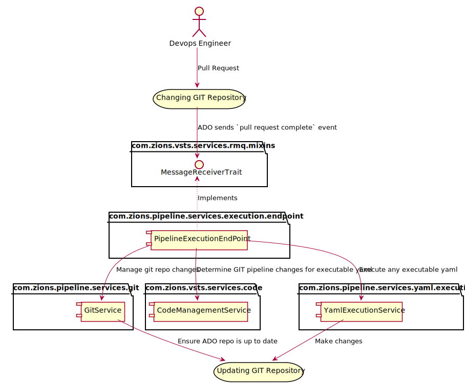
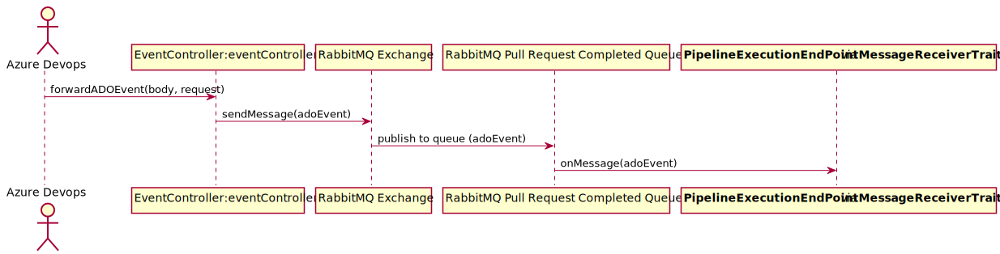
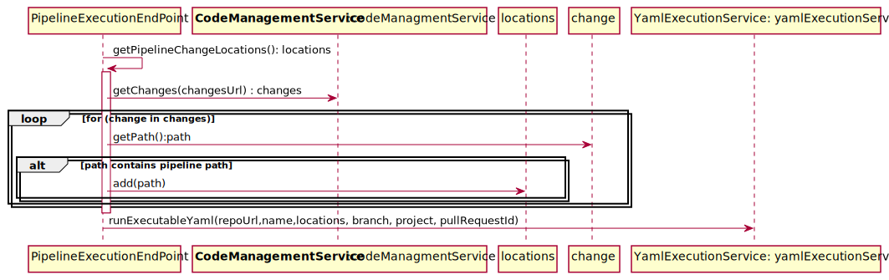
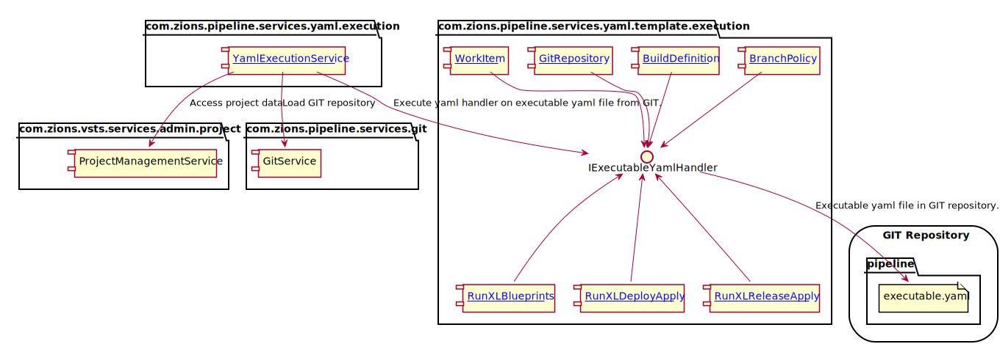
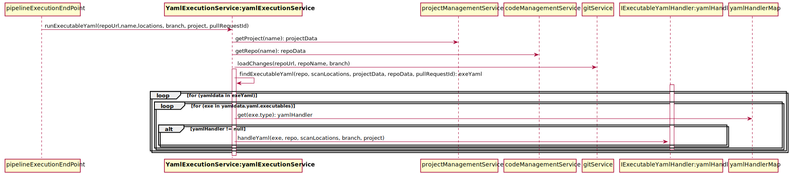

# Introduction

This document will detail the backend processing performed on GIT repo pipeline updates 
via processing from blueprints.


<div hidden>
```{r, include=FALSE}
@startuml Pipeline_main_activities.svg
start
if (doesn't have required blueprints) then (yes)
  :Create/update required blueprints;
endif
:Execute blueprints;

stop
@enduml
```
</div>

Significant processing may occur on the server due to updates to various repos from 
blueprint executions.

### Processing Pipeline Changes



<div hidden>
```{r, include=FALSE}
@startuml Processing_pipeline_changes.svg
actor DE as "Devops Engineer"
storage GR as "Changing GIT Repository"
storage GR2 as "Updating GIT Repository"
DE --> GR: Pull Request

package com.zions.vsts.services.rmq.mixins {
    interface MessageReceiverTrait
}

package com.zions.pipeline.services.execution.endpoint {
  component PEEP as "PipelineExecutionEndPoint"
  PEEP -[dotted]up-> MessageReceiverTrait: Implements
}
GR --> MessageReceiverTrait: ADO sends `pull request complete` event

package com.zions.pipeline.services.git {
    component GS as "GitService"
}
package com.zions.vsts.services.code {
    component CMS as "CodeManagementService"
}
PEEP -do-> CMS: Determine GIT pipeline changes for executable yaml

package com.zions.pipeline.services.yaml.execution {
    component YES as "YamlExecutionService"
}
PEEP -do-> YES: Execute any executable yaml
PEEP -do-> GS: Manage git repo changes
YES -do-> GR2: Make changes
GS -do-> GR2: Ensure ADO repo is up to date
@enduml

```
</div>

### Component: [MessageReceiverTrait](https://dev.azure.com/zionseto/DTS/_git/zions-service-framework?path=%2Fzions-vsts-microservice%2Fsrc%2Fmain%2Fgroovy%2Fcom%2Fzions%2Fvsts%2Fservices%2Frmq%2Fmixins%2FMessageReceiverTrait.groovy) and [PipelineExecutionEndPoint](https://dev.azure.com/zionseto/DTS/_git/zions-service-framework?path=%2Fzions-pipeline-execution-microservice%2Fsrc%2Fmain%2Fgroovy%2Fcom%2Fzions%2Fpipeline%2Fservices%2Fexecution%2Fendpoint%2FPipelineExecutionEndPoint.groovy)

The `MessageReceiverTrait` is critical to all communications coming from ADO via web hook events. 
 Any microservice that handles logic to process a event will implement this `mixin`.  
 This `mixin` contains the required behaviors to handle event from exchanges/queues populated 
 by event publisher handling events from ADO.  Big picture Groovy `trait` (mixin) is a way of implementing 
 multiple inheritance like `C++`.  Opinion, kills over Java.



<div hidden>
```{r, include=FALSE}
@startuml Webhook_sequence.svg
actor ADO as "Azure Devops"
participant EC as "EventController:eventController"
ADO -> EC: forwardADOEvent(body, request)

participant RMQE as "RabbitMQ Exchange"
EC -> RMQE: sendMessage(adoEvent)

participant RMQQ as "RabbitMQ Pull Request Completed Queue"
RMQE -> RMQQ: publish to queue (adoEvent)

participant PEEP as "<b>PipelineExecutionEndPoint</b> via <b>MessageReceiverTrait</b>"
RMQQ -> PEEP: onMessage(adoEvent)
@enduml
```
</div>

### Component: [CodeManagementService](https://dev.azure.com/zionseto/DTS/_git/zions-service-framework?path=%2Fzions-vsts-services%2Fsrc%2Fmain%2Fgroovy%2Fcom%2Fzions%2Fvsts%2Fservices%2Fcode%2FCodeManagementService.groovy)

When a pull request event is sent from ADO it contains data on commits. On pull requests 
this commit data will be used to determine changes made on repository.  If any pipeline 
executeble yaml is to be executed then it will be executed.  Even executable yaml in `executables` 
folder will only be executed if there are changes in `pipeline` folder.



<div hidden>
```{r, include=FALSE}
@startuml CodeManagementService_sequence.svg
participant PEEP as "PipelineExecutionEndPoint"
participant CMS as "<b>CodeManagementService</b>:codeManagmentService"
PEEP -> PEEP: getPipelineChangeLocations(): locations
activate PEEP
participant locations
PEEP -> CMS: getChanges(changesUrl) : changes
loop for (change in changes)
    PEEP -> change: getPath():path
    alt path contains pipeline path
        PEEP -> locations: add(path)
    end
end
deactivate PEEP
participant YES as "YamlExecutionService: yamlExecutionService"
PEEP -> YES: runExecutableYaml(repoUrl,name,locations, branch, project, pullRequestId)

@enduml
```
</div>

### Component: [YamlExecutionService](https://dev.azure.com/zionseto/DTS/_git/zions-service-framework?path=%2Fzions-pipeline-services%2Fsrc%2Fmain%2Fgroovy%2Fcom%2Fzions%2Fpipeline%2Fservices%2Fyaml%2Fexecution%2FYamlExecutionService.groovy)

`YamlExecutionService`'s sole purpose is to run executable yaml snippets driven by any 
changes in a GIT repo `pipeline` folder.  





<div hidden>
```{r, include=FALSE}
@startuml YamlExecutionService_components.svg
package "com.zions.pipeline.services.yaml.execution" {
  component YES as "[[https://dev.azure.com/zionseto/DTS/_git/zions-service-framework?path=%2Fzions-pipeline-services%2Fsrc%2Fmain%2Fgroovy%2Fcom%2Fzions%2Fpipeline%2Fservices%2Fyaml%2Fexecution%2FYamlExecutionService.groovy YamlExecutionService]]"
}
package "com.zions.vsts.services.admin.project" {
    component PMS as "ProjectManagementService"
}

package "com.zions.pipeline.services.git" {
    component GS as "GitService"
}
package "com.zions.pipeline.services.yaml.template.execution" {
  interface IExecutableYamlHandler
  component BP as "[[https://dev.azure.com/zionseto/DTS/_git/zions-service-framework?path=%2Fzions-pipeline-services%2Fsrc%2Fmain%2Fgroovy%2Fcom%2Fzions%2Fpipeline%2Fservices%2Fyaml%2Ftemplate%2Fexecution%2FBranchPolicy.groovy BranchPolicy]]"
  component BD as "[[https://dev.azure.com/zionseto/DTS/_git/zions-service-framework?path=%2Fzions-pipeline-services%2Fsrc%2Fmain%2Fgroovy%2Fcom%2Fzions%2Fpipeline%2Fservices%2Fyaml%2Ftemplate%2Fexecution%2FBuildDefinition.groovy BuildDefinition]]"
  component GR as "[[https://dev.azure.com/zionseto/DTS/_git/zions-service-framework?path=%2Fzions-pipeline-services%2Fsrc%2Fmain%2Fgroovy%2Fcom%2Fzions%2Fpipeline%2Fservices%2Fyaml%2Ftemplate%2Fexecution%2FGitRepository.groovy GitRepository]]"
  component RXLB as "[[https://dev.azure.com/zionseto/DTS/_git/zions-service-framework?path=%2Fzions-pipeline-services%2Fsrc%2Fmain%2Fgroovy%2Fcom%2Fzions%2Fpipeline%2Fservices%2Fyaml%2Ftemplate%2Fexecution%2FRunXLBlueprints.groovy RunXLBlueprints]]"
  component RXLDA as "[[https://dev.azure.com/zionseto/DTS/_git/zions-service-framework?path=%2Fzions-pipeline-services%2Fsrc%2Fmain%2Fgroovy%2Fcom%2Fzions%2Fpipeline%2Fservices%2Fyaml%2Ftemplate%2Fexecution%2FRunXLDeployApply.groovy RunXLDeployApply]]"
  component RXLRA as "[[https://dev.azure.com/zionseto/DTS/_git/zions-service-framework?path=%2Fzions-pipeline-services%2Fsrc%2Fmain%2Fgroovy%2Fcom%2Fzions%2Fpipeline%2Fservices%2Fyaml%2Ftemplate%2Fexecution%2FRunXLReleaseApply.groovy RunXLReleaseApply]]"
  component WI as "[[https://dev.azure.com/zionseto/DTS/_git/zions-service-framework?path=%2Fzions-pipeline-services%2Fsrc%2Fmain%2Fgroovy%2Fcom%2Fzions%2Fpipeline%2Fservices%2Fyaml%2Ftemplate%2Fexecution%2FWorkItem.groovy WorkItem]]"
  BP -do-> IExecutableYamlHandler
  BD --> IExecutableYamlHandler
  GR --> IExecutableYamlHandler
  RXLB -up-> IExecutableYamlHandler
  RXLDA -up-> IExecutableYamlHandler
  RXLRA -up-> IExecutableYamlHandler
  WI -do-> IExecutableYamlHandler
}
YES --> IExecutableYamlHandler : Execute yaml handler on executable yaml file from GIT.
storage "GIT Repository" {
  folder "pipeline" {
      file ey as "executable.yaml"
  }
}
YES -do-> PMS: Access project data
YES -do-> GS: Load GIT repository
IExecutableYamlHandler -do-> ey : Executable yaml file in GIT repository.

@enduml

@startuml YamlExecutionService_sequence.svg
participant PEEP as "PipelineExecutionEndPoint:pipelineExecutionEndPoint"
participant YES as "<b>YamlExecutionService:yamlExecutionService</b>"
participant PMS as "ProjectManagementService:projectManagementService"
PEEP -> YES: runExecutableYaml(repoUrl,name,locations, branch, project, pullRequestId)
YES -> PMS: getProject(name): projectData

participant CMS as "CodeManagementService:codeManagementService"
YES -> CMS: getRepo(name): repoData

participant GS as "GitService:gitService"
YES -> GS: loadChanges(repoUrl, repoName, branch)

activate YES
YES -> YES: findExecutableYaml(repo, scanLocations, projectData, repoData, pullRequestId): exeYaml
loop for (yamldata in exeYaml)
    loop for (exe in yamldata.yaml.executables)
        activate "IExecutableYamlHandler:yamlHandler"
        YES -> yamlHandlerMap: get(exe.type): yamlHandler
        alt yamlHandler != null
            YES -> "IExecutableYamlHandler:yamlHandler": handleYaml(exe, repo, scanLocations, branch, project)
        end
        deactivate "IExecutableYamlHandler:yamlHandler"
    end
end
deactivate YES
@enduml
```
</div>


## Yaml Components (package: com.zions.pipeline.services.yaml.template.execution)


###  Component: [BranchPolicy](https://dev.azure.com/zionseto/DTS/_git/zions-service-framework?path=%2Fzions-pipeline-services%2Fsrc%2Fmain%2Fgroovy%2Fcom%2Fzions%2Fpipeline%2Fservices%2Fyaml%2Ftemplate%2Fexecution%2FBranchPolicy.groovy)

This component provides ability to interpret a yaml snippet of the form: 

```yaml
 - type: branchPolicy
   context: zionseto #optional
   project: ReleaseEngineering #optional
   repoName: arepo
   branchNames: master
   policyData:
     buildData:
       ciBuildName: arepo-ci
       ciBuildFile:  .pipeline/ado/build-ci.yml
     approvalData:
       minApprovers: 1
```

With this yaml this component will ensure the `master` branch within GIR repo, `arepo`, will use CI build with ADO pipeline yaml file **.pipeline/ado/build-ci.yaml*and have at least 1 approver.

* **type** - is the yaml handler to use.
* **context** - the ADO organization. Optional
* **project** - the ADO project with organization. Optional
* **repoName** - the GIT repository with ADO project.
* **branchNames** - the command delimited list of branch names to apply policy.
* **policyData** - yaml element that contains the policy to apply.
  - **buildData** - yaml element that specifies Continuous Integration validation build policy.
    * **ciBuildName** - the name of CI validation build.
    * **ciBuildFile** - the GIT repository file location with ADO pipeline yaml.
  - **approvalData** - the yaml element that will specify approver data.
    * **minApprovers** - the number of approvers.


### Component: [BuildDefinition](https://dev.azure.com/zionseto/DTS/_git/zions-service-framework?path=%2Fzions-pipeline-services%2Fsrc%2Fmain%2Fgroovy%2Fcom%2Fzions%2Fpipeline%2Fservices%2Fyaml%2Ftemplate%2Fexecution%2FBuildDefinition.groovy)

This component provides ability to interpret a yaml snippet of the form: 

```yaml
 - type: buildDefinition
   name: dev/test1-release
   context: eto-dev # Optional
   project: ALMOpsTest # Optional
   queue: 'On-Prem DR'
   repository: 
     name: ALMOpsTest
     defaultBranch: refs/heads/master # Optional
   variables: # Optional
   - name: Good_stuff7
     value: old
     allowOverride: true
```

This yaml will create a ADO build definition with pipeline by the name of `dev/test1-release` in project `ALMOpsTest` that will run on ADO 
pipeline queue `On-Prem DR`.  It will be associated with GIT repository `ALMOpsTest` with default branch being `refs/heads/master`.  It 
will also have a variable that can be used in build call `Good_stuff7`.

- **type** - is the yaml handler to use.
- **context** - the ADO organization. Optional
- **project** - the ADO project with organization. Optional
- **name** - the name/location of build definition.
- **queue** - the ADO queue.
- **repository** - yaml element to specify GIT repository related data.
    - **name** - GIT repository name.
    - **defaultBranch** - the default branch that will trigger build.
- **variables** - free form yaml to specifiy any variables to be used in build that may be override at build creation.

### Component: [GitRepository](https://dev.azure.com/zionseto/DTS/_git/zions-service-framework?path=%2Fzions-pipeline-services%2Fsrc%2Fmain%2Fgroovy%2Fcom%2Fzions%2Fpipeline%2Fservices%2Fyaml%2Ftemplate%2Fexecution%2FGitRepository.groovy)

This component provides ability to interpret a yaml snippet of the form: 

```yaml
 - type: gitRepository
   name: reponame 
   project: projectname # Optional
   branches:
   - name: feature/support
     baseName: master
```

This yaml will create/update a repo with ADO project by the name of `reponame`.  It will also create/update a branch by the name of `feature/support` base upon `head` state of `master` branch.

- **type** - is the yaml handler to use.
- **context** - the ADO organization. Optional
- **project** - the ADO project with organization. Optional
- **name** - the name of GIT repository.
- **branches** - yaml element to specify required set of branch for repository.
    - **branch** - name of branch to ensure.
    - **baseName** - name of base branch to create branch from.
    
### Component: [WorkItem](https://dev.azure.com/zionseto/DTS/_git/zions-service-framework?path=%2Fzions-pipeline-services%2Fsrc%2Fmain%2Fgroovy%2Fcom%2Fzions%2Fpipeline%2Fservices%2Fyaml%2Ftemplate%2Fexecution%2FWorkItem.groovy)

This component provides ability to interpret a yaml snippet of the form: 

```yaml
 - type: workItem
   title: More work to do
   wiType: Task
   description: 'If there is more work, do it.'
   areaPath: DTS/Release Engineering  # Optional
```

This yaml when executed will result in a work item in a task being created/updated with 
specified title, wi type, description and area path.

- **type** - is the yaml handler to use.
- **title** - summary or title of work item.
- **description** - details of work item.
- **wiType** - work item type: Task, User Story, Epic, etc.
- **areaPath** - area path defines an association to Team(s).

This enables the ability to have work items to association with COE GIT automation changes.

### Component: [RunXLBlueprints](https://dev.azure.com/zionseto/DTS/_git/zions-service-framework?path=%2Fzions-pipeline-services%2Fsrc%2Fmain%2Fgroovy%2Fcom%2Fzions%2Fpipeline%2Fservices%2Fyaml%2Ftemplate%2Fexecution%2FRunXLBlueprints.groovy)

- This component will provide ability to execute blueprints on repos that may dependent upon 
changes occuring in blueprint.  This will enable automation of updating output repos 
to changes in blueprints.
- It will also enable chaining a set of blueprints as part of a larger blueprint.
- These runXLBlueprint yaml elements can be templated as part of a parent blueprint.

It will interpret yaml in the following form:

```yaml
 - type: runXLBlueprints
   repoName: callit
   project: AgriculturalFinance
   blueprints:
   - name: windows-app
     repoName: bpRepo
     project: DTS
     answers: # Optional
       ans1: stuff
       ans2: stuff
```

When component executes against the yaml it will/can create multiple blueprints against 
a specific projects repo.  The above instance will execute `windows-app` blueprint from `bpRepo` 
in `DTS` project and place results into ADO project `AgriculturalFinance` GIT repository 
`callit`.

- **type** - name of yaml handler to execute.
- **repoName** - the name of the GIT repository that will updated with pipeline changes.
- **project** - the output project of blueprint updates.
- **blueprints** - yaml element to specify set of blueprints to execute.
    - **name** - the name of the blueprint to execute.
    - **repoName** - GIT repository that houses blueprint.
    - **project** - ADO project that houses blueprint.
    - **answers** - This as set of free form yaml that supplies the answers to a blueprint.  These can be templated as part of a composition of blueprints.

### Component: [RunXLDeployApply](https://dev.azure.com/zionseto/DTS/_git/zions-service-framework?path=%2Fzions-pipeline-services%2Fsrc%2Fmain%2Fgroovy%2Fcom%2Fzions%2Fpipeline%2Fservices%2Fyaml%2Ftemplate%2Fexecution%2FRunXLDeployApply.groovy)

This component is important for handling creating/updating the static aspects of XL 
Deploy, which is mostly Configuration, Infrustructure and Environment.

This component will interpret yaml in the following form:

```yaml
- type: runXLDeployApply
  yamlFile: .pipeline/xl-deploy.yaml
  vault:  # Optional yaml object to setup token replacement from vault
    engine: secret
    path: WebCMS # a path into Vault secret store that can be project specific.  
  values: # Optional for setting up XL CLI values.
  - name: test1
    value: ${xl.password}  # xl.password token to be replaced by Vault
  - name: test2
    value: avalue2
```

With the above yaml when executed with RunXLDeployApply handler we will get updates 
to XL Deploy from `.pipeline/xl-deploy.yaml` with passed values from `values` data.

- **type** - name of yaml handler to execute.
- **yamlFile** - file to pass to XL Deploy CLI to run for XL Deploy update.
- **vault** - Optional yaml object to setup token replacement from vault.
    - **engine** - name of Vault secret engine.
    - **path** - Vault secret path.
- **values** - free form name/value pairs to be passed as parameters to XL CLI.

### Component: [RunXLReleaseApply](https://dev.azure.com/zionseto/DTS/_git/zions-service-framework?path=%2Fzions-pipeline-services%2Fsrc%2Fmain%2Fgroovy%2Fcom%2Fzions%2Fpipeline%2Fservices%2Fyaml%2Ftemplate%2Fexecution%2FRunXLReleaseApply.groovy)

This will be mostly used to update/create plan templates within `XL Release`.

This component will interpret yaml in the following form:

```yaml
 - type: runXLReleaseApply
   yamlFile: .pipeline/xl-release.yaml
   vault:  # Optional yaml object to setup token replacement from Vault
     engine: secret
     path: WebCMS # a path into Vault secret store that can be project specific.  
   values: # Optional for setting up XL CLI values.
   - name: test1
     value: ${xl.password}  # xl.password token to be replaced by Vault
   - name: test2
     value: avalue2
```

With the above yaml when executed with RunXLReleaseApply handler we will get updates 
to XL Release from `.pipeline/xl-release.yaml` with passed values from `values` data.

- **type** - name of yaml handler to execute.
- **yamlFile** - file to pass to XL Release CLI to run for XL Release template updates.
- **vault** - Optional yaml object to setup token replacement from vault.
    - **engine** - name of Vault secret engine.
    - **path** - Vault secret path.
- **values** - free form name/value pairs to be passed as parameters to XL CLI.

 
