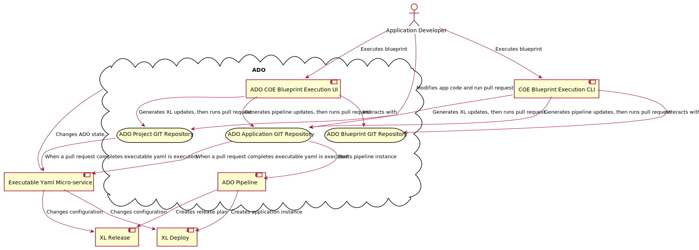
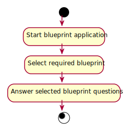
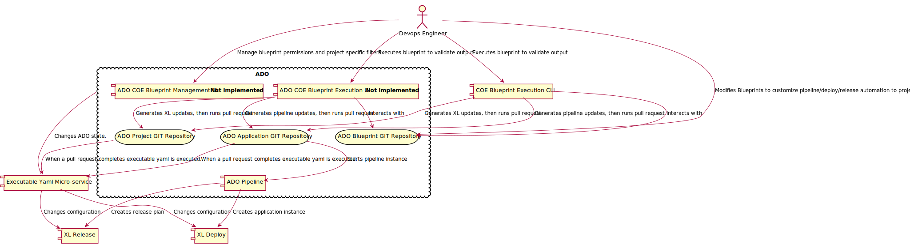
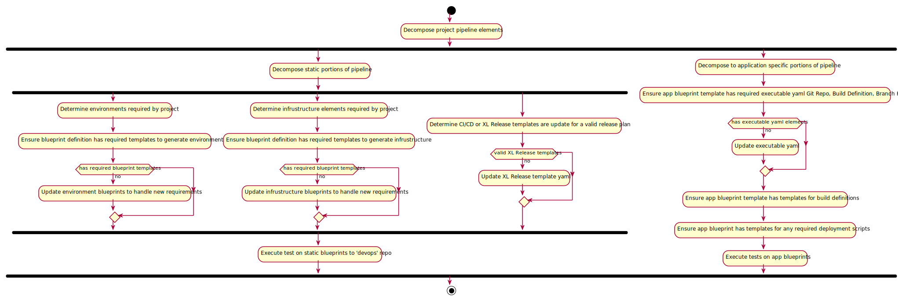

# Introduction

Release Engineering Center Of Excellence (COE) project's main purpose is to provide a level of automation 
to abstract DevOps so all aspects, build/deploy/release, can be centrally self-served by any software 
development team.  

# Goals

- Ensure abstraction of DevOps can be performed without significant knowledge of underline 
  tools.
- Ensure management of DevOps is controlled so change is tracked and auditable.
    - DevOps as code.
- Ensure management of DevOps is centralized to a single tool for any required changes.
    - E.G. Azure Devops
- In order to ensure quality all changed elements of DevOps development should be testable and reviewable.
    - All elements of DevOps development should be stored in GIT and changes should 
    be part of a pull-request. 
    - Unit Testing can be run to eto-dev/xl testqa as part of CI build.

# Stakeholders

- Release Engineering
- DTS Management
- Application Engineering

# Customers

Zions application development teams.

# Process

Elements of the COE Application Developers architecture.



Application Developer's process flow within the COE architecture



Elements of the COE Devops Engineer architecture



Devops Engineer's process flow within the COE architecture



<div hidden>
```{r, include=FALSE}
@startuml COE_AD_Process_components.svg
actor AD as "Application Developer"
component ADOBPECLI as "COE Blueprint Execution CLI"
component BPMS as "Executable Yaml Micro-service"
cloud ADO {
    component ADOBPEUI as "ADO COE Blueprint Execution UI:  <b>Not implemented</b>"
    component ADOP as "ADO Pipeline"
    storage GITBP as "ADO Blueprint GIT Repository"
    storage GITPROJECT as "ADO Project GIT Repository"
    storage GITAPP as "ADO Application GIT Repository"
}
AD -do-> ADOBPECLI: Executes blueprint
AD -do-> ADOBPEUI: Executes blueprint
AD -do-> GITAPP: Modifies app code and run pull request
ADOBPECLI -do-> GITBP: Interacts with
ADOBPECLI -do-> GITPROJECT: Generates XL updates, then runs pull request
ADOBPECLI -do-> GITAPP: Generates pipeline updates, then runs pull request
ADOBPEUI -do-> GITBP: Interacts with
ADOBPEUI -do-> GITPROJECT: Generates XL updates, then runs pull request
ADOBPEUI -do-> GITAPP: Generates pipeline updates, then runs pull request
component XLR as "XL Release"
component XLD as "XL Deploy"

GITPROJECT -do-> BPMS: When a pull request completes executable yaml is executed.
GITAPP -do-> BPMS: When a pull request completes executable yaml is executed.
GITAPP -do-> ADOP: Starts pipeline instance
ADOP -do-> XLD:  Creates application instance
ADOP -do-> XLR:  Creates release plan

BPMS -up- ADO: Changes ADO state.
BPMS -do-> XLD: Changes configuration
BPMS -do-> XLR: Changes configuration
@enduml

@startuml COE_AD_Process_activities.svg
start
:Start blueprint application;
:Select required blueprint;
:Answer selected blueprint questions;
stop
@enduml


@startuml COE_DE_Process_components.svg
actor DE as "Devops Engineer"
component ADOBPECLI as "COE Blueprint Execution CLI"
component BPMS as "Executable Yaml Micro-service"
cloud ADO {
    component ADOBPMUI as "ADO COE Blueprint Management UI: <b>Not implemented</b>"
    component ADOBPEUI as "ADO COE Blueprint Execution UI:  <b>Not implemented</b>"
    component ADOP as "ADO Pipeline"
    storage GITBP as "ADO Blueprint GIT Repository"
    storage GITPROJECT as "ADO Project GIT Repository"
    storage GITAPP as "ADO Application GIT Repository"
}
component XLR as "XL Release"
component XLD as "XL Deploy"

DE -do-> ADOBPMUI:  Manage blueprint permissions and project specific filters.
DE -do-> GITBP: Modifies Blueprints to customize pipeline/deploy/release automation to project needs
DE -do-> ADOBPECLI: Executes blueprint to validate output
DE -do-> ADOBPEUI: Executes blueprint to validate output
ADOBPECLI -do-> GITBP: Interacts with
ADOBPECLI -do-> GITPROJECT: Generates XL updates, then runs pull request
ADOBPECLI -do-> GITAPP: Generates pipeline updates, then runs pull request
ADOBPEUI -do-> GITBP: Interacts with
ADOBPEUI -do-> GITPROJECT: Generates XL updates, then runs pull request
ADOBPEUI -do-> GITAPP: Generates pipeline updates, then runs pull request

GITPROJECT -do-> BPMS: When a pull request completes executable yaml is executed.
GITAPP -do-> BPMS: When a pull request completes executable yaml is executed.
GITAPP -do-> ADOP: Starts pipeline instance
ADOP -do-> XLD:  Creates application instance
ADOP -do-> XLR:  Creates release plan

BPMS -up- ADO: Changes ADO state.
BPMS -do-> XLD: Changes configuration
BPMS -do-> XLR: Changes configuration
@enduml

@startuml COE_DE_Process_activities.svg
start
:Decompose project pipeline elements;
fork
  :Decompose static portions of pipeline;
  fork
    :Determine environments required by project;
    :Ensure blueprint definition has required templates to generate environments;
    if (has required blueprint templates) then (no)
       :Update environment blueprints to handle new requirements;
    endif
  fork again
    :Determine infrustructure elements required by project;
    :Ensure blueprint definition has required templates to generate infrustructure;
    if (has required blueprint templates) then (no)
       :Update infrustructure blueprints to handle new requirements;
    endif
  fork again
    :Determine CI/CD or XL Release templates are update for a valid release plan;
    if (valid XL Release templates) then (no)
       :Update XL Release template yaml;
    endif
  end fork
  :Execute test on static blueprints to 'devops' repo;
fork again
  :Decompose to application specific portions of pipeline;
    :Ensure app blueprint template has required executable yaml Git Repo, Build Definition, Branch Policy;
    if (has executable yaml elements) then (no)
       :Update executable yaml;
    endif
    :Ensure app blueprint template has templates for build definitions;
    :Ensure app blueprint has templates for any required deployment scripts;
    :Execute tests on app blueprints;
end fork

stop
@enduml
```
</div>


# Risks

- Learning curve.
- Complexity of training.
- Potential for customer to make changes that fail pipeline.
- Actual complexity of a unit test solution for pipeline code.
- Alternate project requirements.
- Drive to simplify customer usage will raise complexity and lower potential flexibility of solution.

# Gaps

- **5** [Usability](https://dev.azure.com/zionseto/DTS/_workitems/edit/970959) 
    - Central UI to manage and execute blueprints
    - **2** Ensure XL CLI is wrapped and handling of blueprint locations is automated/wrapped. **Eric**
- **3** [Training](https://dev.azure.com/zionseto/DTS/_workitems/edit/972901)
    - No training material  ??
    - Team coaching on extending ADO, XLs and adding micro-services.  **Eric** & **James**
    - **1** **Not enough actual usage collateral for samples/examples.**  **James** & **Ashwin**
- **4** [Testing](https://dev.azure.com/zionseto/DTS/_workitems/edit/970967) 
    - No defined test methodology
    - No defined test architecture  **Eric**
    - No stub method  **James**
- **1** [Provisioning](https://dev.azure.com/zionseto/DTS/_workitems/edit/970404) - **not far off, but needs a little more attention and recipe to use.**  **James**
    - Service Connections
        - All projects
        - Need strategy        
    - Service Hooks
    - Change Requests - In Scope??
        - Firewall
- **2** [Secrets Management](https://dev.azure.com/zionseto/DTS/_workitems/edit/1510636) - **Vault host needs to be setup to be more production ready.**  **Brian**
    - We should be able to lookup against multiple paths 
    for executions.
- **5** [Audit & Traceability](https://dev.azure.com/zionseto/DTS/_workitems/edit/970959)  ???
    - Enable feedback to ADO Release work item on status of a release.  **Ashwin**

# Timeline