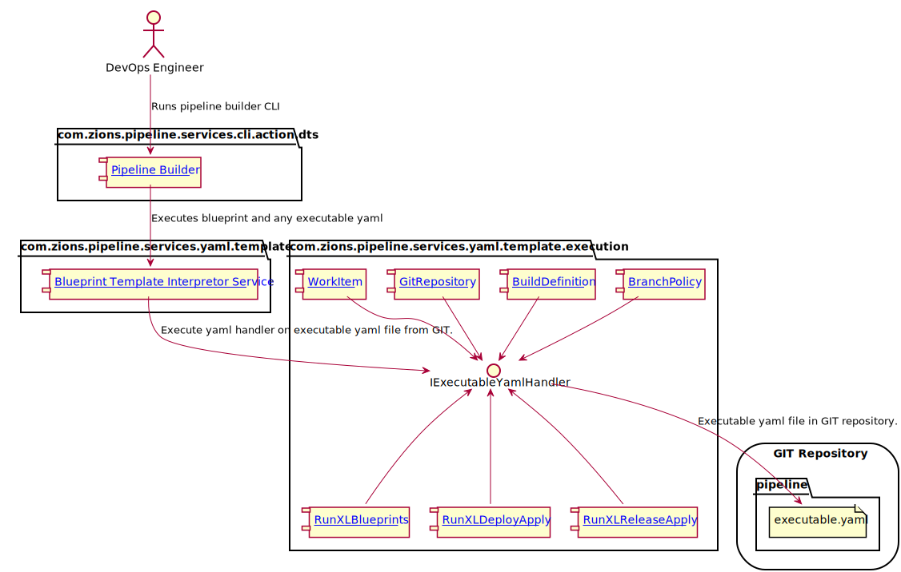
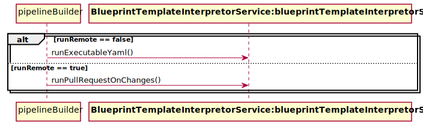
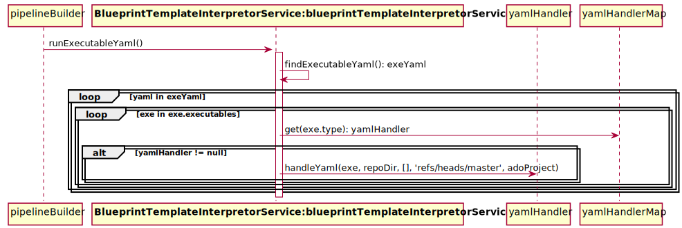
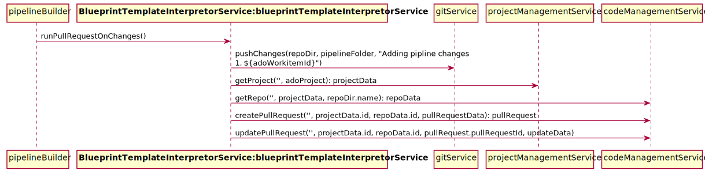

# Introduction
This document outlines command line actions provided for ADO/XLD/XLR CI/CD automation.  It lays out design details of each component involved 
in running and processing XL blueprints via a Command Line Interface (CLI).

# Pipeline Builder Components



<div hidden>
```{r, include=FALSE}
@startuml PipelineBuilder_components.svg
actor RE as "DevOps Engineer"
package "com.zions.pipeline.services.cli.action.dts" {
   component PB as "[[https://dev.azure.com/zionseto/DTS/_git/zions-service-framework?path=%2Fzions-pipeline-cli%2Fsrc%2Fmain%2Fgroovy%2Fcom%2Fzions%2Fpipeline%2Fservices%2Fcli%2Faction%2Fdts%2FPipelineBuilder.groovy&version=GBmaster&line=1&lineEnd=2&lineStartColumn=1&lineEndColumn=1&lineStyle=plain Pipeline Builder]]"
} 
RE --> PB : "Runs pipeline builder CLI"
package "com.zions.pipeline.services.yaml.template" {
  component BTIS as "[[https://dev.azure.com/zionseto/DTS/_git/zions-service-framework?path=%2Fzions-pipeline-services%2Fsrc%2Fmain%2Fgroovy%2Fcom%2Fzions%2Fpipeline%2Fservices%2Fyaml%2Ftemplate%2FBlueprintTemplateInterpretorService.groovy Blueprint Template Interpretor Service]]"
}
PB --> BTIS: Executes blueprint and any executable yaml
package "com.zions.pipeline.services.yaml.template.execution" {
  interface IExecutableYamlHandler
  component BP as "[[https://dev.azure.com/zionseto/DTS/_git/zions-service-framework?path=%2Fzions-pipeline-services%2Fsrc%2Fmain%2Fgroovy%2Fcom%2Fzions%2Fpipeline%2Fservices%2Fyaml%2Ftemplate%2Fexecution%2FBranchPolicy.groovy BranchPolicy]]"
  component BD as "[[https://dev.azure.com/zionseto/DTS/_git/zions-service-framework?path=%2Fzions-pipeline-services%2Fsrc%2Fmain%2Fgroovy%2Fcom%2Fzions%2Fpipeline%2Fservices%2Fyaml%2Ftemplate%2Fexecution%2FBuildDefinition.groovy BuildDefinition]]"
  component GR as "[[https://dev.azure.com/zionseto/DTS/_git/zions-service-framework?path=%2Fzions-pipeline-services%2Fsrc%2Fmain%2Fgroovy%2Fcom%2Fzions%2Fpipeline%2Fservices%2Fyaml%2Ftemplate%2Fexecution%2FGitRepository.groovy GitRepository]]"
  component RXLB as "[[https://dev.azure.com/zionseto/DTS/_git/zions-service-framework?path=%2Fzions-pipeline-services%2Fsrc%2Fmain%2Fgroovy%2Fcom%2Fzions%2Fpipeline%2Fservices%2Fyaml%2Ftemplate%2Fexecution%2FRunXLBlueprints.groovy RunXLBlueprints]]"
  component RXLDA as "[[https://dev.azure.com/zionseto/DTS/_git/zions-service-framework?path=%2Fzions-pipeline-services%2Fsrc%2Fmain%2Fgroovy%2Fcom%2Fzions%2Fpipeline%2Fservices%2Fyaml%2Ftemplate%2Fexecution%2FRunXLDeployApply.groovy RunXLDeployApply]]"
  component RXLRA as "[[https://dev.azure.com/zionseto/DTS/_git/zions-service-framework?path=%2Fzions-pipeline-services%2Fsrc%2Fmain%2Fgroovy%2Fcom%2Fzions%2Fpipeline%2Fservices%2Fyaml%2Ftemplate%2Fexecution%2FRunXLReleaseApply.groovy RunXLReleaseApply]]"
  component WI as "[[https://dev.azure.com/zionseto/DTS/_git/zions-service-framework?path=%2Fzions-pipeline-services%2Fsrc%2Fmain%2Fgroovy%2Fcom%2Fzions%2Fpipeline%2Fservices%2Fyaml%2Ftemplate%2Fexecution%2FWorkItem.groovy WorkItem]]"
  component SC as "ServiceConnection"
  component WHS as "WebHookSubscriptions"
  BP -do-> IExecutableYamlHandler
  BD --> IExecutableYamlHandler
  GR --> IExecutableYamlHandler
  RXLB -up-> IExecutableYamlHandler
  RXLDA -up-> IExecutableYamlHandler
  RXLRA -up-> IExecutableYamlHandler
  SC -up-> IExecutableYamlHandler
  WHS --> IExecutableYamlHandler
  WI -do-> IExecutableYamlHandler
}
BTIS --> IExecutableYamlHandler : Execute yaml handler on executable yaml file from GIT.
storage "GIT Repository" {
  folder "pipeline" {
	  file ey as "executable.yaml"
  }
}
IExecutableYamlHandler -do-> ey : Executable yaml file in GIT repository.
@enduml
```
</div>

### Component: [Pipeline Builder](https://dev.azure.com/zionseto/DTS/_git/zions-service-framework?path=%2Fzions-pipeline-cli%2Fsrc%2Fmain%2Fgroovy%2Fcom%2Fzions%2Fpipeline%2Fservices%2Fcli%2Faction%2Fdts%2FPipelineBuilder.groovy&version=GBmaster&line=1&lineEnd=2&lineStartColumn=1&lineEndColumn=1&lineStyle=plain) - CLI Arguments:

When a **DevOps Engineer** executes the **Pipeline Builder CLI** the following arguments must be set on CLI:

- **run.remote** - If set to true this will run all executable yaml through an automated 
  pull-request.  Thus, it would end up executing executable yaml on server.
- **repo.dir** - location of GIT repository housing executable yaml.
- **blueprint.dir** - local file system location of loaded XL blueprints.
- **blueprint** - the name of the XL blueprint to execute.
- **out.dir** - file system location to generate blueprint output.
- **pipeline.folder** - folder within **out.dir** to place generated pipeline implementation.
- **ado.project** - if automating pull request, this is the target ADO project to use.
- **repo.target.branch** - if automating pull request, this will be the target branch 
  of pull request.
- **ado.workitemid** - if automating pull request, this will be the work item associated 
  with pull request.

### Component: [Blueprint Template Interpretor Service](https://dev.azure.com/zionseto/DTS/_git/zions-service-framework?path=%2Fzions-pipeline-services%2Fsrc%2Fmain%2Fgroovy%2Fcom%2Fzions%2Fpipeline%2Fservices%2Fyaml%2Ftemplate%2FBlueprintTemplateInterpretorService.groovy&version=GBmaster&line=1&lineEnd=2&lineStartColumn=1&lineEndColumn=1&lineStyle=plain)

This component performs the following behaviors:

- Runs a XL Blueprint to a specified, **out.dir**, location.
  


- If 'run.remote' == false, the executes any executable yaml generated to **out.dir** location.
  


- If 'run.remote' == true, it will execute any executable yaml via a automatic pull 
  request.



<div hidden>
```{r, include=FALSE}
@startuml PipelineBuilder_sequence.svg
participant pipelineBuilder
participant BTLS as "<b>BlueprintTemplateInterpretorService:blueprintTemplateInterpretorService</b>"
alt runRemote == false
    pipelineBuilder -> BTLS: runExecutableYaml()
else runRemote == true
    pipelineBuilder -> BTLS: runPullRequestOnChanges()
end
@enduml 

@startuml BlueprintTemplateInterpretorService_remote_false_seq.svg
participant pipelineBuilder
participant BTLS as "<b>BlueprintTemplateInterpretorService:blueprintTemplateInterpretorService</b>"
pipelineBuilder -> BTLS: runExecutableYaml()
activate BTLS
BTLS ->  BTLS: findExecutableYaml(): exeYaml
loop yaml in exeYaml
  loop exe in exe.executables
    BTLS -> yamlHandlerMap: get(exe.type): yamlHandler
    alt yamlHandler != null
       BTLS-> yamlHandler: handleYaml(exe, repoDir, [], 'refs/heads/master', adoProject)
    end
  end
end
deactivate BTLS
participant yamlHandlerMap
@enduml

@startuml BlueprintTemplateInterpretorService_remote_true_seq.svg
participant pipelineBuilder
participant BTLS as "<b>BlueprintTemplateInterpretorService:blueprintTemplateInterpretorService</b>"
pipelineBuilder -> BTLS: runPullRequestOnChanges()
BTLS -> gitService: pushChanges(repoDir, pipelineFolder, "Adding pipline changes \n#${adoWorkitemId}")
BTLS -> projectManagementService: getProject('', adoProject): projectData
BTLS -> codeManagementService: getRepo('', projectData, repoDir.name): repoData
BTLS -> codeManagementService: createPullRequest('', projectData.id, repoData.id, pullRequestData): pullRequest
BTLS -> codeManagementService: updatePullRequest('', projectData.id, repoData.id, pullRequest.pullRequestId, updateData)
@enduml
```
</div>

## [Yaml Components](https://zionsconfluence.cs.zionsbank.com/display/SCM/DS%3A+COE%3A+Components)

Executable yaml handler documentation.
